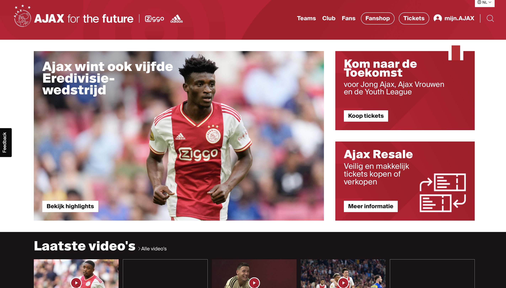
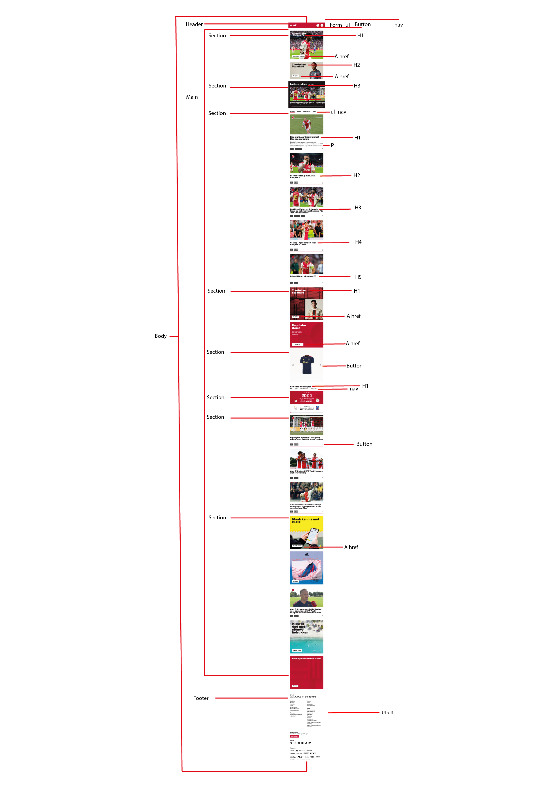

# Procesverslag
Markdown is een simpele manier om HTML te schrijven.  
Markdown cheat cheet: [Hulp bij het schrijven van Markdown](https://github.com/adam-p/markdown-here/wiki/Markdown-Cheatsheet).

Nb. De standaardstructuur en de spartaanse opmaak van de README.md zijn helemaal prima. Het gaat om de inhoud van je procesverslag. Besteedt de tijd voor pracht en praal aan je website.

Nb. Door *open* toe te voegen aan een *details* element kun je deze standaard open zetten. Fijn om dat steeds voor de relevante stuk(ken) te doen.

## Jij

  
uitwerken voor kick-off werkgroep

  ### Auteur:
  Jaiden Huijts 

  #### Je startniveau:
  blauw

  #### Je focus:
  responsive  
 

## Je website

  
uitwerken voor kick-off werkgroep

  ### Je opdracht:
https://www.ajax.nl

  #### Screenshot(s) van de eerste pagina (small screen): 
  Home pagina ajax
  

  #### Screenshot(s) van de tweede pagina (small screen):
  Ticket pagina ajax 
  
 

## Toegankelijkheidstest 1/2 (week 1)

  
uitwerken na test in 1e werkgroep

  ### Bevindingen
  Lijst met je bevindingen die in de test naar voren kwamen:

  #### Screenreader
 Screenreader: De screenreader van Ajax is over het algemeen heel goed bruikbaar. Er zijn heel veel artikelen & video’s waardoor je heel veel moet tikken om eindelijk daarvoor bij te zijn. Ook wordt het menu boven het nieuws niet gezien door de screenreader en dus wordt deze geskipt.

  #### Muis en Toetsenbord 
  Hier korte omschrijving (met indien nodig afbeeldingen)

  Hier een omschrijving van hoe het opgelost kan worden (met indien nodig afbeeldingen)

  #### Motoriek (shocks, elastiekjes)
  •	Alles dichtbij elkaar te vinden dus makkelijk bereikbaar op beide pagina’s
  •	Veel content op 1 pagina waardoor het heel lastig is voor iemand om zich te concentrerern

  #### Visueel (brillen, contrast, kleurenblind, dark/light). 
 Bij blurred vision zijn de #’s niet te lezen, voor de rest kan je van alles nog wel wat maken. Over alle andere kleurblindheden blijft alles goed leesbaar, alleen de tekst op afbeeldingen blijft soms wat slecht leesbaar, maar dat was voor de normaal zienden ook al zo

## Breakdownschets (week 1)

  
uitwerken na afloop 2e werkgroep

  ### de hele pagina: 
  

  ### dynamisch deel (bijv menu): 
  

## Voortgang 1 (week 2)

  
uitwerken voor 1e voortgang

  ### Stand van zaken
  hier dit ging goed & dit was lastig (neem ook screenshots op van delen van je website en code)

  ### Agenda voor meeting
  samen met je groepje opstellen

  | student 1      | student 2          | student 3    | student 4        |
  | Jaiden            | ---                | ---          | ---              |
  | -Plakkende footer  | en dit             | en ik dit    | en dan ik dat    |
  |            | dit als er tijd is | nog een punt | dit wil ik zeker |
  |                | ...                | ...          | ...              |

  ### Verslag van meeting
  hier na afloop snel de uitkomsten van de meeting vastleggen

  - Html netter
  - Soms is less more

## Voortgang 2 (week 3)

  
Afgelopen week veel vast gelopen met het gebruiken van grid en flexbox. Ik denk vaak te moeilijk na terwijl het heel simpel kan. Buiten dat om heb ik wel grote stappen gezet qua vormgeving en nader ik de eindstreep met mijn vormgeving voor de homepagina. Ik heb bijna heel de footer afgemaakt op paar kleine dingetjes na en ga mij voorbereiden op de javascript voor deze pagina.

  ### Stand van zaken
  Na gepuzzel met het gebruik van grid in de footer heb ik eindelijk alle onderdelen netjes geordend dus daar was ik blij mee. Ik ben nu vooral bezig met het na maken van hoe de content zelf zoals afbeeldingen en filmpjes worden vorm gegeven 

  ### Agenda voor meeting
  samen met je groepje opstellen

  | student 1      | student 2          | student 3    | student 4        |
  | Jaiden            | ---                | ---          | ---              |
  | Footer social en 
  sponsor buttons niet 
  naast elkaar | en dit             | en ik dit    | en dan ik dat    |
  |Tekst vergroot niet mee | dit als er tijd is | nog een punt | dit wil ik zeker |
  | ...            | ...                | ...          | ...              |

  ### Verslag van meeting
  hier na afloop snel de uitkomsten van de meeting vastleggen

  - punt 1
  - punt 2
  - nog een punt
- ...

## Toegankelijkheidstest 2/2 (week 4)

  
uitwerken na test in 8e werkgroep

  ### Bevindingen
  Lijst met je bevindingen die in de test naar voren kwamen (geef ook aan wat er verbeterd is):

  #### Screenreader
  Hier korte omschrijving (met indien nodig afbeeldingen)

  Hier een omschrijving van hoe het opgelost kan worden (met indien nodig afbeeldingen)

  #### Muis en Toetsenbord 
  Hier korte omschrijving (met indien nodig afbeeldingen)

  Hier een omschrijving van hoe het opgelost kan worden (met indien nodig afbeeldingen)

  #### Motoriek (shocks, elastiekjes)
  Hier korte omschrijving (met indien nodig afbeeldingen)

  Hier een omschrijving van hoe het opgelost kan worden (met indien nodig afbeeldingen)

  #### Visueel (brillen, contrast, kleurenblind, dark/light). 
  Hier korte omschrijving (met indien nodig afbeeldingen)

  Hier een omschrijving van hoe het opgelost kan worden (met indien nodig afbeeldingen)

## Voortgang 3 (week 4)

  
uitwerken voor 3e voortgang

  ### Stand van zaken
  hier dit ging goed & dit was lastig (neem ook screenshots op van delen van je website en code)

  ### Agenda voor meeting
  samen met je groepje opstellen

  | student 1      | student 2          | student 3    | student 4        |
  | ---            | ---                | ---          | ---              |
  | dit bespreken  | en dit             | en ik dit    | en dan ik dat    |
  | en dat ook nog | dit als er tijd is | nog een punt | dit wil ik zeker |
  | ...            | ...                | ...          | ...              |

  ### Verslag van meeting
  hier na afloop snel de uitkomsten van de meeting vastleggen

  - punt 1
  - punt 2
  - nog een punt
  - ...

## Eindgesprek (week 5)

  
uitwerken voor eindgesprek

  ### Je uitkomst - karakteristiek screenshots:
  

  ### Dit ging goed/Heb ik geleerd: 
  Korte omschrijving met plaatjes

  

  ### Dit was lastig/Is niet gelukt:
  Korte omschrijving met plaatjes

  

## Bronnenlijst

  
continu bijhouden terwijl je werkt

  Nb. Wees specifiek ('css-tricks' als bron is bijv. niet specifiek genoeg).

  1. bron 1
  2. bron 2
  3. ...

